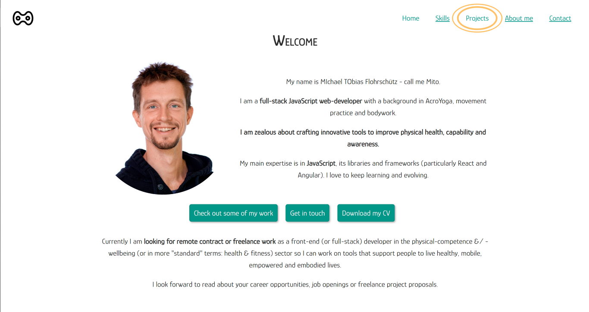

# Portfolio website

## Screenshot


## Production version
[View page here: mitothis.de](https://mitothis.de/)

This project started as a static website to learn HTML and CSS, but turned into a full-grown portfolio website.

## Built with
For practice reasons I chose to refrain from rebuilding it using libraries or build tools, so every line of code here is hand-written HTML, CSS and JavaScript.

### Contact form
To protect my email address from spam bots I created a AWS API and a AWS lamda function which is evoked upon submission of the contact form. It sends me an email with the form content through AWS SES. 
For this I used serverless module. So I kind of lied above when saying there is no library in this project. But I didn't in the sense that there is no library used for the actual website it self.

Note: Since I want to receive the email in my google mail inbox, I had to use a second email address as the sender address, because google mail hides emails sent and received by the same account.

#### Usage:
1. Install serverless library: `npm install -g serverless`
2. Get credentials from [AWS Management Console](https://aws.amazon.com/console/)
3. Configure serverless `serverless config credentials --provider aws --key ACCESS_KEY_ID --secret SECRET_ACCESS_KEY`
4. Create `secrets.json` in the contact-form-api folder containing this info:
    ```
    {
    "NODE_ENV": "dev",
    "RECIPIENT": "YOUR_EMAIL-ADRESS_1",
    "SENDER": "YOUR_EMAIL-ADRESS_2",
    "DOMAIN": "http://YOUR_DOMAIN",
    "DOMAIN_WWW": "https://www.YOUR_DOMAIN"
    }
    ```
5. Navigate terminal into contact-form-api folder, then run `serverless deploy`
6. Replace AWS lambda URL in contact-form.js